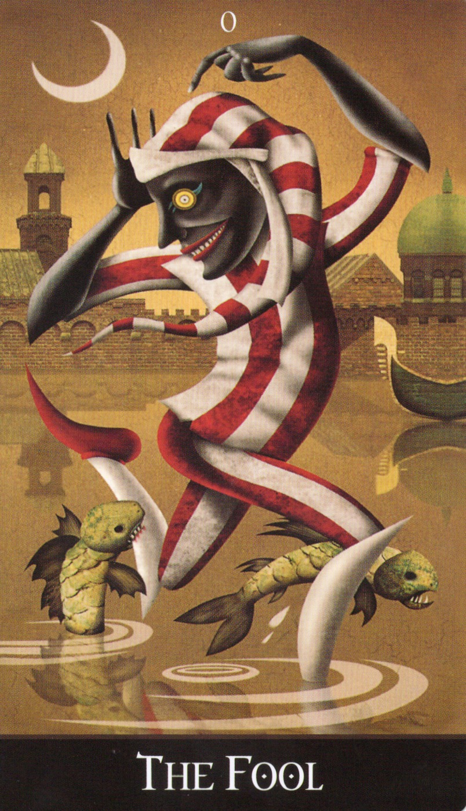
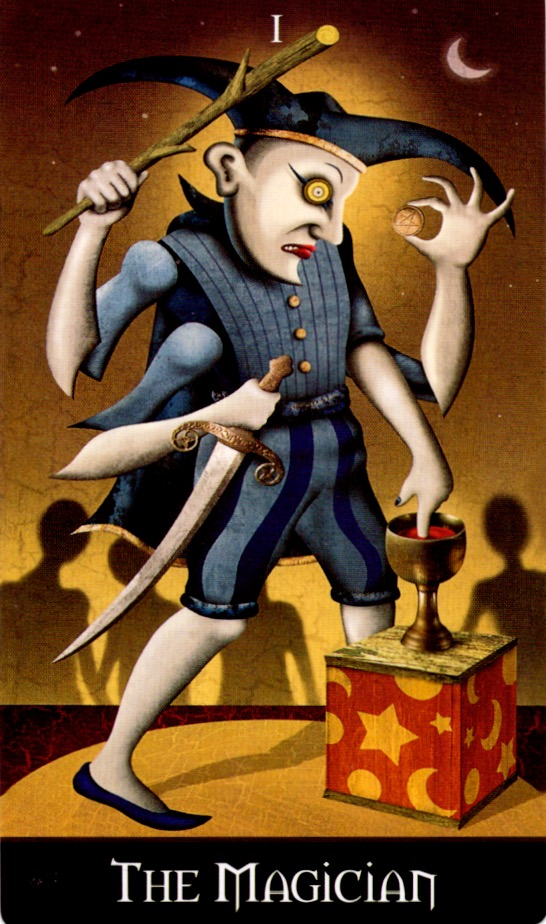
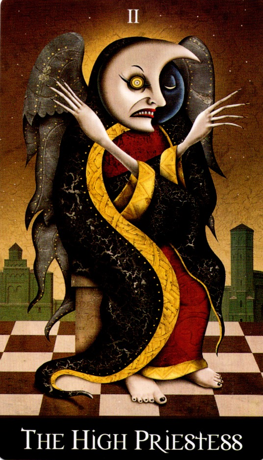
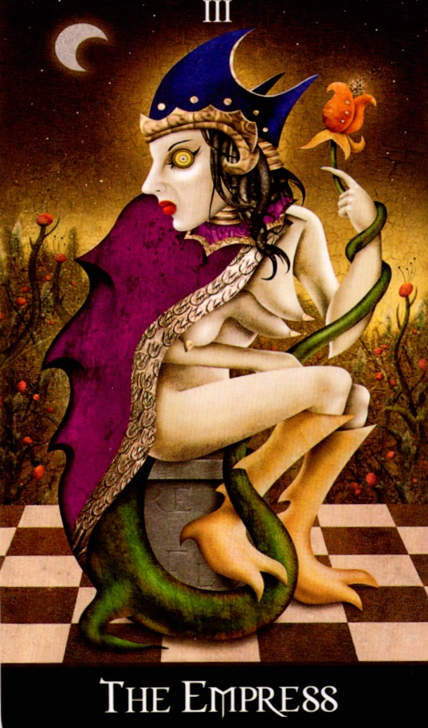
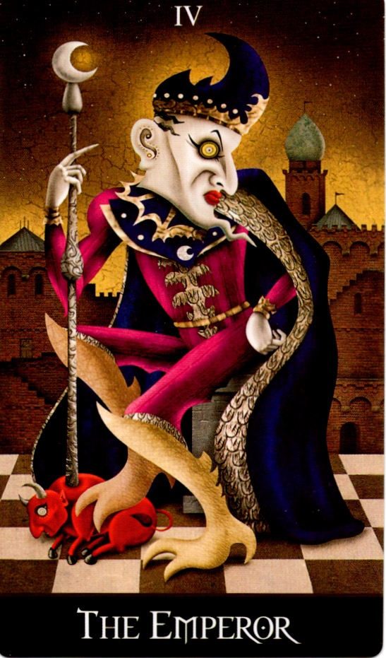
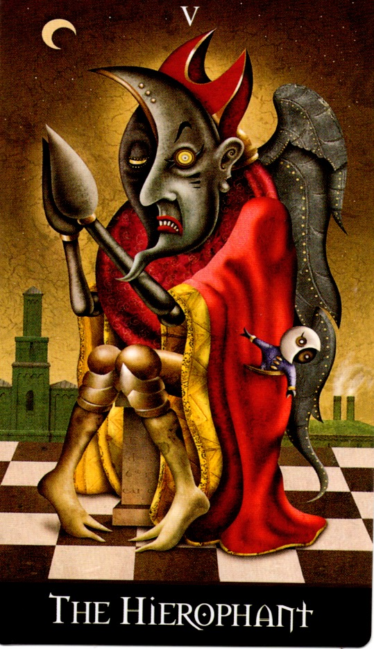
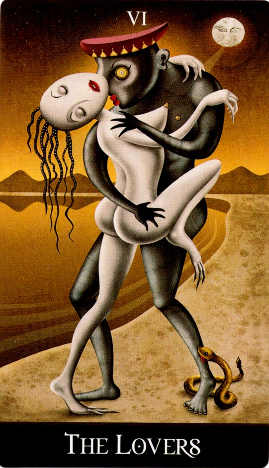

# Deviant Moon Tarot 解説Zine

**著者：ravensgate（@ravensgate8457）**  
**期間：2025年6月8日〜 継続中**  
**形式：全78枚のカードを1日1枚ずつ考察し、象徴・解釈・創作背景を記録**

---

## 概要

このZineは、Deviant Moon Tarot の全78枚のカードについて、日々Xで公開している象徴解釈や創作背景の考察をアーカイブし、構造的にアクセス可能な形でまとめたものです。  
各カードは以下の要素で構成されます：

- 正位置・逆位置の解釈（心理的・神秘主義的観点）
- 作者による創作背景・象徴源の記録
- アートワークの特徴分析（主に初期スケッチや意匠由来）
- 引用元：該当日のX投稿（および投稿予定日）リンク

---

## カード一覧（随時更新）

| No | カード名 | 投稿日 | 画像 |
|----|----------|--------|------|
| 0  | [愚者（The Fool）](#愚者the-fool) | 2025/06/08 |   |
| 1  | [魔術師（The Magician）](#魔術師the-magician) | 2025/06/09 |   |
| 2  | [高位の女司祭（The High Priestess）](#高位の女司祭the-high-priestess) | 2025/06/10 |   |
| 3  | [女帝（The Empress）](#女帝the-empress) | 2025/06/11 |   |
| 4  | [皇帝（The Emperor）](#横堤the-emperor) | 2025/06/12 |   |
| 5  | [法皇（The Hierophant）](#法皇the-hierophant) | 2025/06/13 |   |
| 6  | [恋人（The Lovers）](#恋人the-lovers) | 2025/06/14 |   |
| …  | ...      | ...    |...  |
---

## 各カードの考察

### 愚者（The Fool）

**正位置：**  
愚者は、既存の枠を捨てて自分だけの道を切り開くよう促す。夢や直感に従い、準備不足でも自分を信じて挑戦することが重要である。他者からは無謀に見えるかもしれないが、未知の能力を信じて進むべきだと示唆している。

**逆位置：**  
逆位置では、インスピレーションの喪失や未知への恐れ、想像力の欠如を表す。また、新しい挑戦への躊躇や安全な選択を求める姿勢を示すこともある。

**創作背景：**  
作者は幼少期から過去世の記憶のような幻想を抱き、ヴェネツィアの運河で踊る狂気の道化師のイメージに取り憑かれていた。タロットとの出会いがそのイメージを具現化するきっかけとなり、愚者のキャラクターを描き続け。初期のスケッチは失われたものの、成長とともに絵の技術やキャラクターの発展が進んだ。20代で新しいタロットデッキを試みたが、幼少期のアイデアが強く残り、最終的に「Deviant Moon」というデッキを完成させた。

**画像：**  

---

### 魔術師（The Magician）

魔術師は、まだ熟練していない初心者でありながら、自信を持ち、努力と集中を通じて目標を達成する未来を思い描いている。彼は4つの小アルカナの象徴を操り、痛みや犠牲を伴う芸術を追求する。膝元の箱は宇宙の物質的な象徴であり、努力と忍耐によって人間も神々も報酬を得られることを示している。

**正位置：**  
魔術師は練習、犠牲、集中によってスキルを習得できることを示し、自信を持って創造力を発揮するよう促す。

**逆位置：**  
逆位置では、才能の浪費や誤用、混乱や自信の欠如を警告する。

**創作背景：**  
この魔術師のデザインはヴェネツィアのファッションに影響を受けている。作者が1982年に描いた物語の挿絵が初期の形態である。魔術師の体のデザインは抽象とリアリズムを融合させ、4つのスーツの象徴を扱うために複数の腕を持つ形となった。このスタイルは後のデッキ全体に影響を与えている。

**画像：**  

---

### 高位の女司祭（The High Priestess）

彼女は人間と神聖な知性の間の門番として描かれ、古代の知識を守りながら、それを必要とする者にのみ明かす。彼女の翼は石化しており、知識を守る使命が彼女の自由を制限している。衣服には過去の学者の精神的な痕跡が刻まれ、知識が他者の進歩に基づいて進化することを象徴している。彼女の頭部は半分が三日月の形をしており、意識的な知識と無意識的な夢の状態を同時に表している。

**正位置：**  
正位置では、直感を活用して知識を実践的に使うことの重要性を示す。

**逆位置：**  
逆位置では、無知や秘密主義、既存の信念体系を再評価する必要性を示唆する。

**創作背景：**  
キャラクターのデザインは古代ギリシャの陶器のスタイルや作者の過去の絵画から影響を受けており、意識と無意識の二重性を象徴する「二重の月の顔」が特徴的である。このキャラクターは、作者が夢で見た「沈黙を崇拝する翼のある修道女」にインスパイアされている。

**画像：**  

---

### 女帝（The Empress）

女帝は、創造的エネルギーの具現と育成を司る存在として描かれている。彼女の身体からは蛇のようなツルが伸び、腕に巻きついた先には今にも開花しそうな橙色の蕾がある。彼女は妊娠初期にあり、母性の喜びと同時に、これまでの自由を手放すことへの不安に心を揺らしている。
彼女の足には鉤爪があり、それがツルと格闘するような描写は、責任への葛藤を象徴している。
しかし、ツルが彼女自身の一部であると受け入れるとき、彼女は初めて内なる平和を見出し、より高貴な人生の段階へと進む準備が整う。

**正位置：**  
創造的エネルギーを具現化するための「育む姿勢」の大切さを示している。
空想を現実へと導くためには、自らを肥沃な土壌として耕し、忍耐と献身をもって育て上げなければならない。
女帝は、アイデアやプロジェクトが「自分自身の延長」であると認識し、時間をかけて育てる価値を教えてくれる。

**逆位置：**  
無関心や自己放棄が「心の庭」に雑草を生やし、創造性の芽を窒息させるリスクを警告する。
また、責任からの逃避や、アイデアの中絶（途中で投げ出すこと）を暗示する可能性もある。

**創作背景：**  
このキャラクターは、「三つの胸」を持ち、育む準備がすでに整っていることを象徴している。
作者によれば、チェック模様の床は過去生の悪夢の記憶から着想されたもので、「暗い部屋で檻の中に閉じ込められた幼い子供」が見た恐怖の光景が背景に反映されている。
こうした要素が、彼女の「未熟さ」「不安定な母性」「育むことへの怖れと受容」の両義的な姿を際立たせている。

**画像：**  

---

### 皇帝（The Emperor）

皇帝は理性と自己制御によって精神を統御し、内なる秩序を現実の支配へと昇華させた存在として描かれる。皇帝は自身の意志と知性の力で悪魔のような存在を地面に押さえつけ、意志の勝利を象徴している。杖の先には銀色の三日月が浮かび、これは彼の潜在意識が具体的な力となって現れたことを意味する。皇帝が頭を指さす姿は、真の勇気とは心ではなく「思考」から生まれることを伝えている。

**正位置：**  
正位置では、自己を律し、自らの精神と行動を統御することの重要性を強調する。潜在意識の力を恐れず活用し、明確な意図と行動によって目標を達成せよと促す。

**逆位置：**  
一方、逆位置では、自己不信や優柔不断により、精神の集中を欠き、外部の影響に振り回される危険性を示唆する。

**創作背景：**  
このカードの初期案では、皇帝の衣の下から三人の騎士が現れ、裏切りの赤い雄牛に立ち向かう構図が描かれていたが、最終的には雄牛の頭部を悪魔の姿へと変更し、理性と無意識の象徴的な対峙がより明確に表現されている。

**画像：**  

---

### 法皇（The Hierophant）

かつては精神的啓示を求めて旅立った彼も、今やその教義に疑念を抱き、内心では信仰の維持に苦悩している。信徒の心を恐れで縛り、ポケットに入った「脳のない人形」のように従順さを強いる法王は、自由意志ではなく「安心感という幻想」によって権威を保っている。膝を固く閉ざし、翼は石のように硬化しており、それは性や自由に対する抑圧的な態度の象徴である。

**正位置：**  
正位置では、旧来の信念や習慣を見直す時が来たことを示唆する。誰かの教義に盲従するのではなく、自らの思考で真理を探り、自分だけの信仰や実践を育てよというメッセージ。

**逆位置：**  
逆位置では、伝統や習慣からの離脱に対する恐れや、不安が精神の自由を妨げている状態を表す。悪習慣が根深く、自ら変化を起こす力を見失っているかもしれない。

**創作背景：**  
このカードに描かれたキャラクターは、作者が16歳の頃、授業中に落書きした宗教者たちのスケッチから着想を得ている。信仰というテーマに対する懐疑の芽は、当時からすでに心に宿っていたのかもしれない。

**画像：**  

---

###  恋人（The Lovers）

砂漠の湖畔で身体を絡ませる恋人たちは、それぞれの違いに惹かれ合い、一つの魂として融合しようとしている。女は感情の役割を担い、その髪は水面へと導き、深い無意識を象徴する。男は肉体性に強く反応し、目を見開いたまま女の首筋にキスをしているが、彼の脚には蛇が噛みついており、情熱の毒がすでに二人の体内に巡り始めている。頭上の月は理性を曇らせ、愛の陶酔に拍車をかける。

**正位置：**  
逆位置では、エネルギーの不調和や関係の破綻を警告する。引き合うはずの力が反発し合い、不一致や誤った動機で結ばれた関係はやがて争いや分裂を招くだろう。

**逆位置：**  
逆位置では、伝統や習慣からの離脱に対する恐れや、不安が精神の自由を妨げている状態を表す。悪習慣が根深く、自ら変化を起こす力を見失っているかもしれない。

**創作背景：**  
なお、このカードの女性キャラクターは作者の10代の作品に登場していたマリオネット風の裸婦シリーズから発展したものであり、同種の人物はThree of CupsやAce of Cupsなどにも登場している。

**画像：**  

---

## 参考文献・リンク

- [公式サイト：Deviant Moon Tarot](https://www.deviantmoon.com)

---

## 更新情報

- 2025/06/08: 開始。愚者（The Fool）投稿
- 2025/06/09: 魔術師（The Magician）投稿

---

## 免責

本Zineは非公式な解釈と記録を目的としたものです。著作権は各カードデザインおよび書籍に帰属します。

