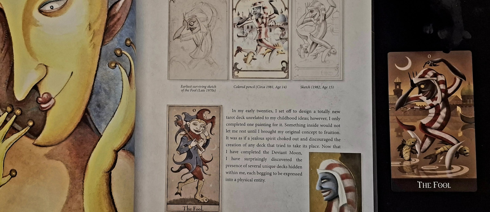
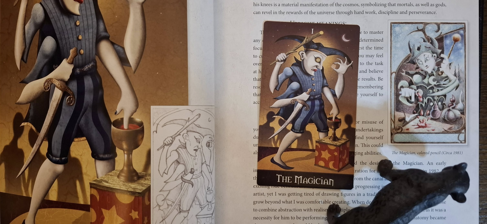

# Deviant Moon Tarot 解説Zine

**著者：ravensgate（@ravensgate8457）**  
**期間：2025年6月8日〜 継続中**  
**形式：全78枚のカードを1日1枚ずつ考察し、象徴・解釈・創作背景を記録**

---

## 概要

このZineは、Deviant Moon Tarot の全78枚のカードについて、日々Xで公開している象徴解釈や創作背景の考察をアーカイブし、構造的にアクセス可能な形でまとめたものです。  
各カードは以下の要素で構成されます：

- 正位置・逆位置の解釈（心理的・神秘主義的観点）
- 作者による創作背景・象徴源の記録
- アートワークの特徴分析（主に初期スケッチや意匠由来）
- 引用元：該当日のX投稿リンク

---

## カード一覧（随時更新）

| No | カード名 | 投稿日 | 投稿リンク | 画像 |
|----|----------|--------|-------------|------|
| 0  | [愚者（The Fool）](#愚者the-fool) | 2025/06/08 | [Xの投稿を見る](0_Fool.png) |  |
| 1  | [魔術師（The Magician）](#魔術師the-magician) | 2025/06/09 | [Xの投稿を見る](1_magician.png) |  |
| …  | ...      | ...    | ...         | ...  |

---

## 各カードの考察

### 愚者（The Fool）

**正位置：**  
愚者は、既存の枠を捨てて自分だけの道を切り開くよう促す。夢や直感に従い、準備不足でも自分を信じて挑戦することが重要とされる。

**逆位置：**  
インスピレーションの喪失や未知への恐れ、想像力の欠如。安全志向に偏る姿勢も暗示。

**創作背景：**  
作者が幼少期から抱いていた幻視や妄想が基となり、ヴェネツィアの道化師に触発された初期スケッチを起点に、20代でこのキャラクター像が完成した。

**画像：**  

---

### 魔術師（The Magician）

**正位置：**  
スキルの習得、集中と意志による創造力の発揮を示す。

**逆位置：**  
誤用・浪費・傲慢さへの警告。

**創作背景：**  
1982年に描かれた抽象的な神話画が原型。ヴェネツィアのファッションに影響を受けた意匠が、4スーツの象徴を扱う複腕デザインに進化した。

**画像：**  

---

## 参考文献・リンク

- [公式サイト：Deviant Moon Tarot](https://www.deviantmoon.com)
- [作者インタビュー・制作ノートなど（予定）](./notes/...)

---

## 更新情報

- 2025/06/08: 開始。愚者（The Fool）投稿
- 2025/06/09: 魔術師（The Magician）投稿

---

## 免責

本Zineは非公式な解釈と記録を目的としたものです。著作権は各カードデザインおよび書籍に帰属します。

